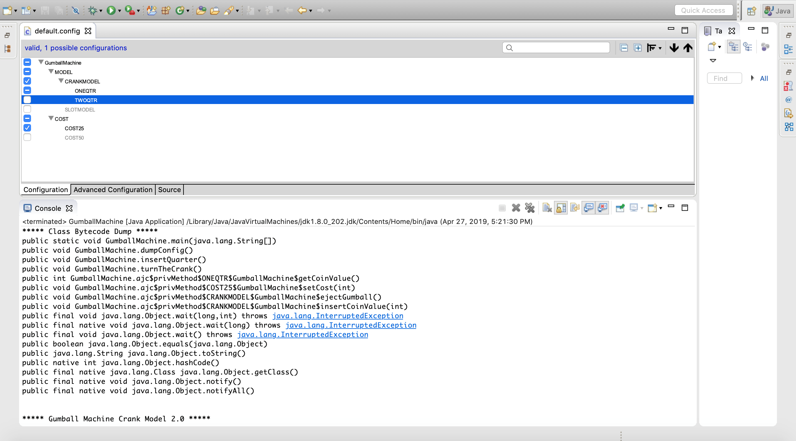
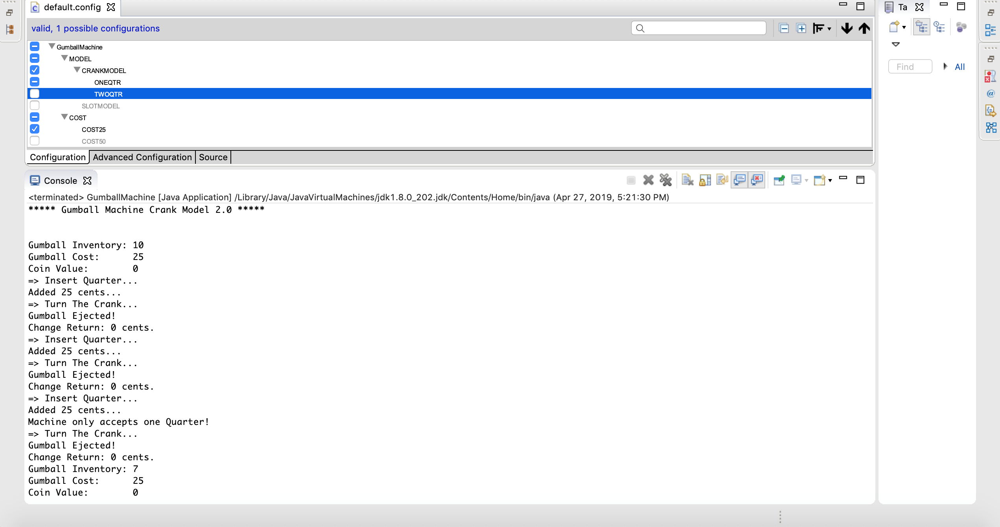
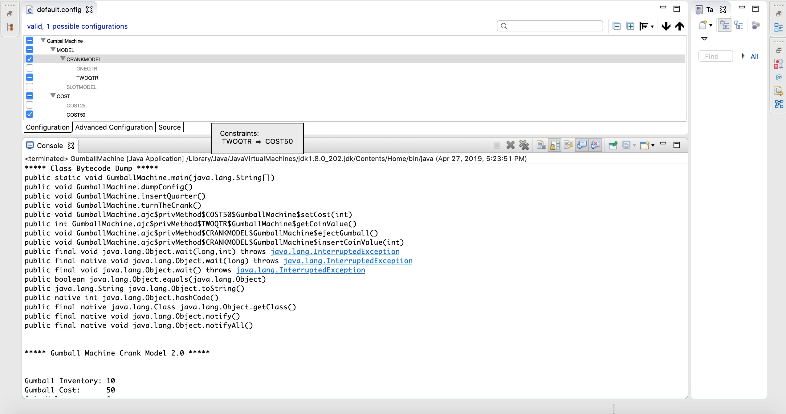
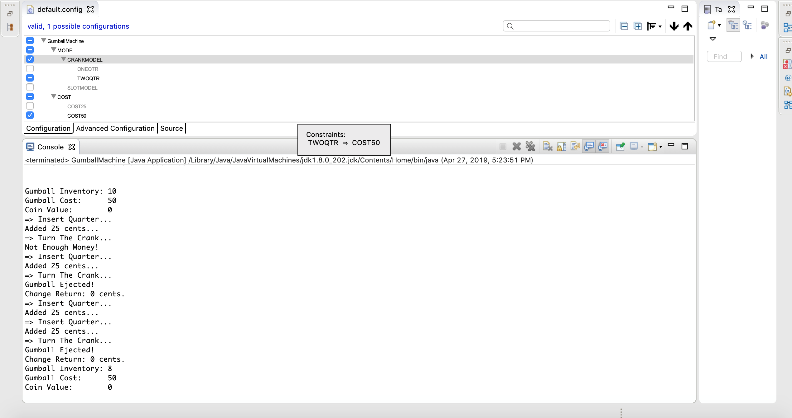
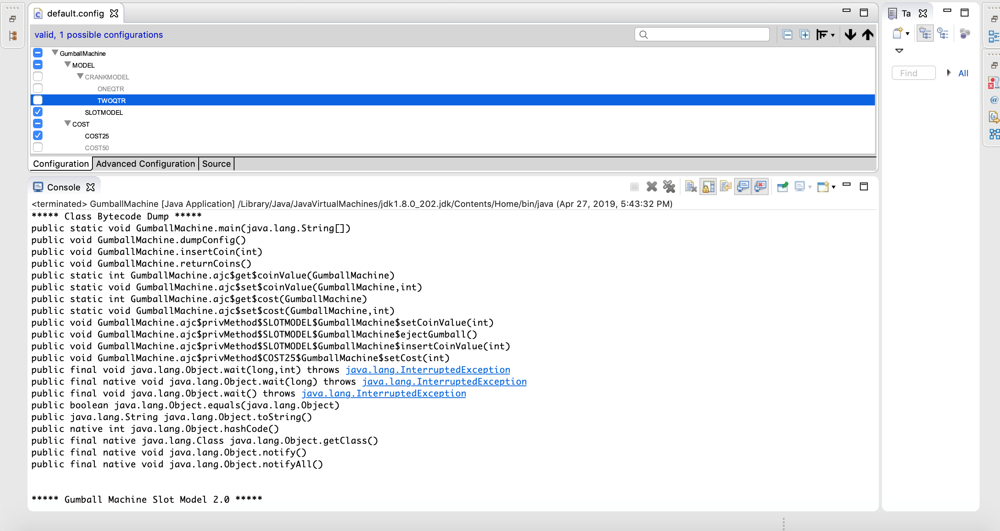
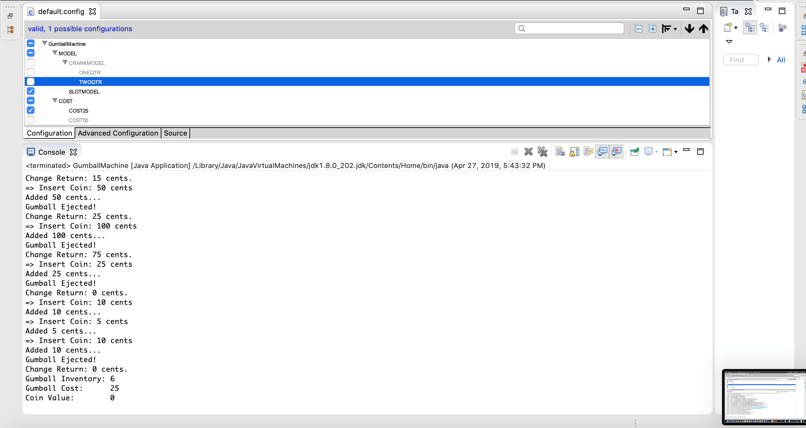
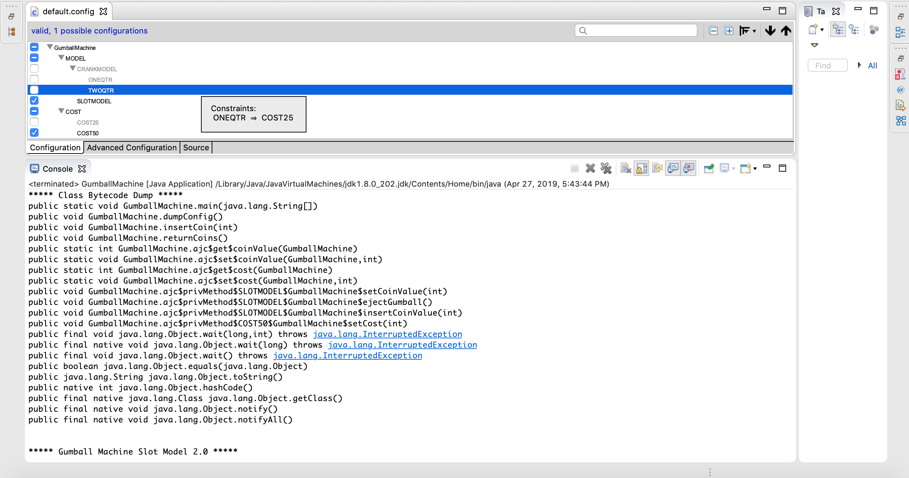
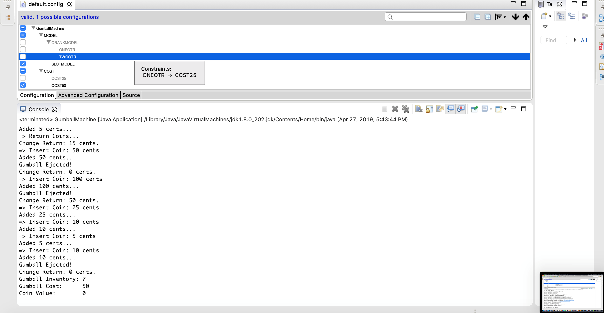

## Lab 10

Gumball Machine Problem

#### Lab 1 Approach
- I used inheritance to solve both the problem.
- The common properties in the three machines was num_of_gumballs instance variable and releaseGumball method. So I had encapsulated these in the base class.
- Rest of the functionalities varies for each machine, so I had implemented those in the subclasses class.
- In this approach sepearte logic had to be written in code to handle all the cases.

#### Lab 10 Approach
- With the feature Id approach, config file can be used to fit in all crank model as well as slot model.
- The code is unscattered and the design is modular.
- If any new feature is required, it can be added easily.

#### Output Screenshots
- Crank Model - 25 cents 

- Crank Model - 50 cents 

- Slot Model - 25 cents 

- Slot Model - 50 cents 

